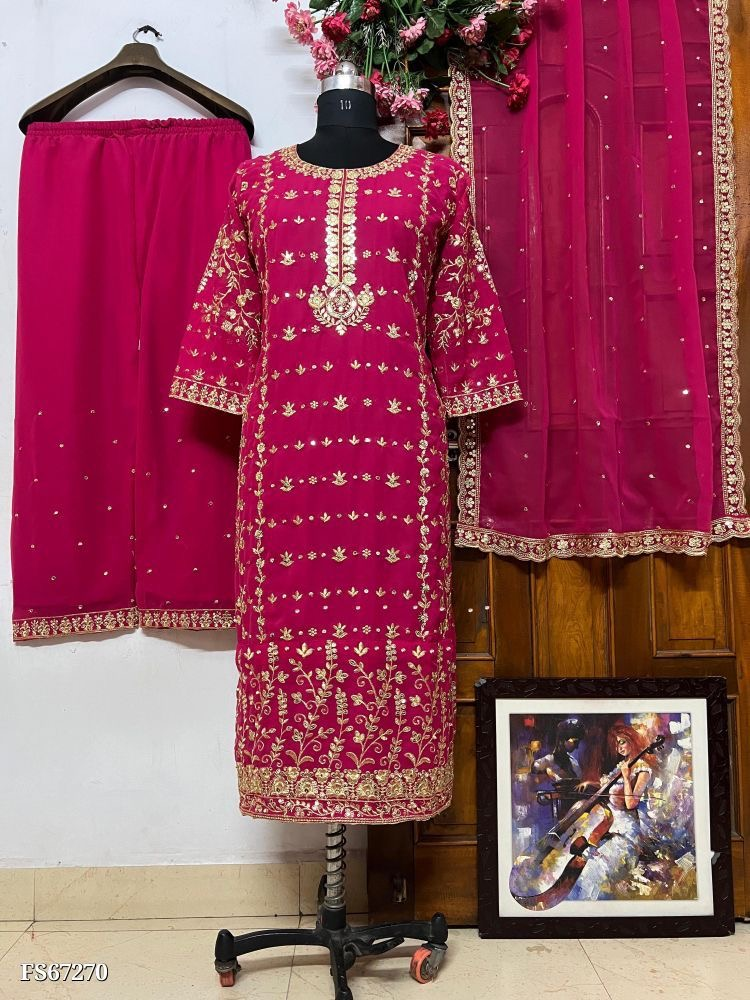

<!DOCTYPE html>
<html lang="en">
<head>
  <meta charset="UTF-8">
  <title>Clothing Queen – Punjabi Suits</title>
  
</head>
<body>

  <h1>Welcome to Clothing Queen 👑</h1>
  

    Punjabi Suits Boutique 
    DM to order on Instagram: <strong>@clothingqueen_7</strong> 
    📦 Shipping Worldwide
  

  

    
    
    
    
    
    
    
    
  

</body>
</html>
